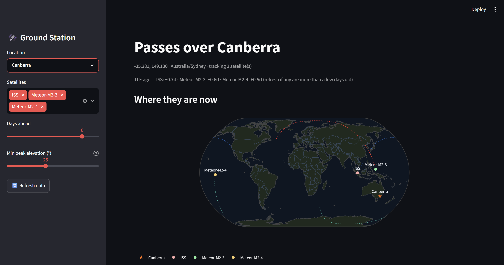

# Relocatable Satellite Ground Station  [](https://luke-ground-station.streamlit.app/)

*A portable ground station for tracking weather satellites from anywhere — currently deployed in Canberra and Ann Arbor.*



<!-- Replace docs/dashboard.png with a real screenshot of the running dashboard.
     A recruiter skims — this image does more work than any paragraph here. -->

Predicts satellite passes over any of your ground stations and shows where to point —
built location-aware so it follows you between sites (e.g. Canberra ↔ Ann Arbor).
Tracks the ISS and the live **Meteor-M2** weather satellites, with a live map,
an upcoming-pass table, and a sky-view plot of any pass.

## Why this project

Most beginner guides to receiving weather-satellite imagery target the NOAA APT
satellites — but **all of those (NOAA-15, -18, -19) were decommissioned in 2025**,
so the majority of existing tutorials are now obsolete. This project targets the
**current** constellation instead: the Russian Meteor-M2 satellites, which broadcast
higher-quality digital LRPT imagery at ~137 MHz.

It's also built **location-aware from the ground up**: the observer site is
configuration, not a hardcoded assumption, so the same code predicts passes from
+42° latitude (Michigan) and −35° latitude (Australia) in the same year — opposite
hemispheres, same tool.

## What it does

- **Live map** — where each tracked satellite is right now, with a short forward ground track.
- **Upcoming passes** — a time-sorted table for the selected station, in correct local time.
- **Sky view** — a polar plot of any pass (centre = overhead, edge = horizon) showing exactly where to point.
- **Multi-station** — switch locations from a dropdown; add new ones in one line of config.

## Files

- `predictor.py` — the engine: loads TLEs, finds passes, computes look angles and
  live positions. No UI; import it from anywhere.
- `app.py` — the Streamlit dashboard (live map, pass table, sky view).
- `iss_passes.py` — the original minimal CLI (ISS-only). Optional starting point.

## Setup

```bash
python3 -m venv .venv
source .venv/bin/activate        # Windows: .venv\Scripts\activate
pip install -r requirements.txt
```

## Run

```bash
streamlit run app.py
```

Then pick a location and satellites in the sidebar.

## Configure

Edit the two dicts at the top of `predictor.py`:

- `STATIONS` — add a place with lat/lon/elevation and an IANA timezone.
- `SATELLITES` — add a satellite by NORAD catalog number (verify IDs at celestrak.org).

## How it works (the interesting parts)

- **Orbit propagation** from TLEs (two-line element sets) via SGP4.
- **Coordinate transform** from an Earth-centred inertial frame to a local
  azimuth/elevation "look angle" — the heart of turning an orbit into "point there".
- **Timezone-correct** multi-site scheduling using `zoneinfo` (handles DST on both
  hemispheres' opposite calendars).

## Roadmap

- **Next:** hardware "receive leg" — an RTL-SDR dongle + SatDump to capture real
  Meteor-M2 LRPT imagery, scheduled from this predictor's pass times.
- Georeferenced image overlays and predicted-vs-actual pass comparison.

## Notes

- TLEs are cached locally and re-downloaded ~daily; the dashboard shows their age.
- "Min peak elevation" ~25° is a good target — low passes decode poorly.

## License

MIT — see [LICENSE](LICENSE).
